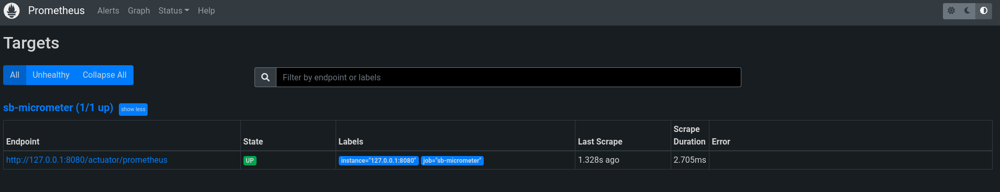
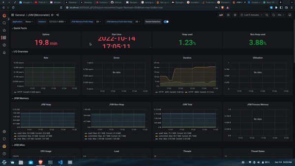

# Monitoring Spring Boot application using 3 TOOLS in 3 STEPS

It is now a usual normal that applications need monitoring. Monitoring JVM based applications are very easy today. Lot's of tools that provide out of the box monitoring options. However, it is also important to understand the underlying basics when it comes to monitoring the applications.

Whenever I build the spring boot applications, I ensure that by default the applications are enabled to be monitored.

In this example, we will try to figure out how a spring boot application can be monitored using 3 tools and 3 steps.

## 3 Tools

Here are the 3 tools that we will be using. You can visit the corresponding websites and documentations on each tool to know more about them. However the true fact is you don't need to be an expert in these tools to make them work.

* [Micrometer](https://micrometer.io/)
* [Prometheus](https://prometheus.io/)
* [Grafana](https://grafana.com/)

## 3 Steps

Here are the 3 steps to complete the entire process.

* Expose Metrics - Configure Micrometer to expose the metrics from your spring boot application
* Scrape Metrics - Configure Prometheus to scrape the metrics from your spring boot application at a periodic interval
* Display Metrics - Configure Grafana to pull the data from prometheus datasource and represent them on a dashboard

## Expose Metrics

The only thing we need to understand here is the fact that we just need to expose the metrics to prometheus in the format it is expecting so that it can scrape the metrics from our application at regular intervals. Spring boot provides us all the metrics with the acutator library which needs to be converted to the format that prometheus is expecting.

To do this, let us first create a sample spring boot application. You can use the [spring initializer](https://start.spring.io/) to do the same. While creating the application, ensure that you have selected the actuator and web dependencies. 

In case you already have a spring boot application, you can skip this step, however ensure that you have the acutator and web dependencies in your application already.

Now let's do the magic to transform the metrics in the format prometheus is expecting. Add this starter library in your pom.xml of your spring boot application.

```xml
<!-- micrometer prometheus dependency -->
<dependency>
    <groupId>io.micrometer</groupId>
    <artifactId>micrometer-registry-prometheus</artifactId>
</dependency>
```

This micrometer library will make sure that all your acutator data is converted to the format required by prometheus when it scrapes the data.

That is all you need to do on your spring boot application. So easy isn't it.

Bring up your spring boot application. Check that you are able to see the metrics from the end point by visiting your application at the URL [http://127.0.0.1:8080/actuator/prometheus](http://127.0.0.1:8080/actuator/prometheus). Here I assume your application runs at port 8080.

You should be able to see the metrics as shown in the image below.


## Scrape Metrics

Now that the metrics from your application is ready to be pulled in, let's bring up prometheus and try to scrape the data from the application.

There are 2 steps in the process.

* Configure a prometheus.yml file that contains the details about our application end point from which the data needs to be scraped. The following contents below ae self explainatory. We configure the scrape interval, the job name and from which endpoint the data needs to be scraped.

```yml

global:
  scrape_interval: 10s

scrape_configs:
  - job_name: 'sb-micrometer'
    metrics_path: '/actuator/prometheus'
    scrape_interval: 5s
    static_configs:
      - targets: ['127.0.0.1:8080']

```

* Bring up prometheus application using the previous configured yml file. We will use docker container here for simpilcity. You can bring up the prometheus application using the command below.

```bash
docker run -d --network="host" -p 9090:9090 -v $PWD/prometheus.yml:/etc/prometheus/prometheus.yml prom/prometheus
```

* Once your container is up and running, you should be able to access prometheus at [http://localhost:9090/](http://localhost:9090/). Visit the Status -> Target menu and you should be able to see the targets that we configured previously in the yml file with state as UP.




That's all. Now you are successfully scraping the data from your application endpoint into prometheus.

## Display Metrics

The last step is to configure grafana to display the metrics. We will be using docker container here for simplicity. This is a 3 step process.

* Bring up grafana using the following command below. Once your container is up, you can visit [http://127.0.0.1:3000/](http://127.0.0.1:3000/) and check that you are able to see a login page. The default username and password is admin/admin. Login into grafana.

```bash
docker run --network="host" -d -p 3000:3000 grafana/grafana
```


* Configure the datasource. Now you need to tell grafana where the prometheus datasource is from which the metrics will be pulled into our grafana dashboards. Here are the images that show you how to configure the prometheus datasource. Under configuration option, select the datasources.


* Add the datasource. Ensure that the URL is entered as http://127.0.0.1:9090. You can leave rest of the data as default and save the data.


* You should see a message stating that the datasource is working.


* Now we will add a default micrometer dashboard using the dashboards available from the grafana community dashboards. Under the Dashboard, select the import option. You should see the screen as shown below.


* Enter the URL as [https://grafana.com/grafana/dashboards/4701](https://grafana.com/grafana/dashboards/4701), click on the load button. You should be able to now see the screen as shown below.



That's all. Now you can save this dashboard.

Full source code for the example is available at [https://github.com/vensr/sb-micrometer](https://github.com/vensr/sb-micrometer)

## References

* Spring Boot Documentation [https://docs.spring.io/spring-boot/docs/2.0.x/reference/html/production-ready-metrics.html](https://docs.spring.io/spring-boot/docs/2.0.x/reference/html/production-ready-metrics.html)
* [Micrometer](https://micrometer.io/)
* [Prometheus](https://prometheus.io/)
* [Grafana](https://grafana.com/)
* Example Application [https://github.com/vensr/sb-micrometer](https://github.com/vensr/sb-micrometer)

